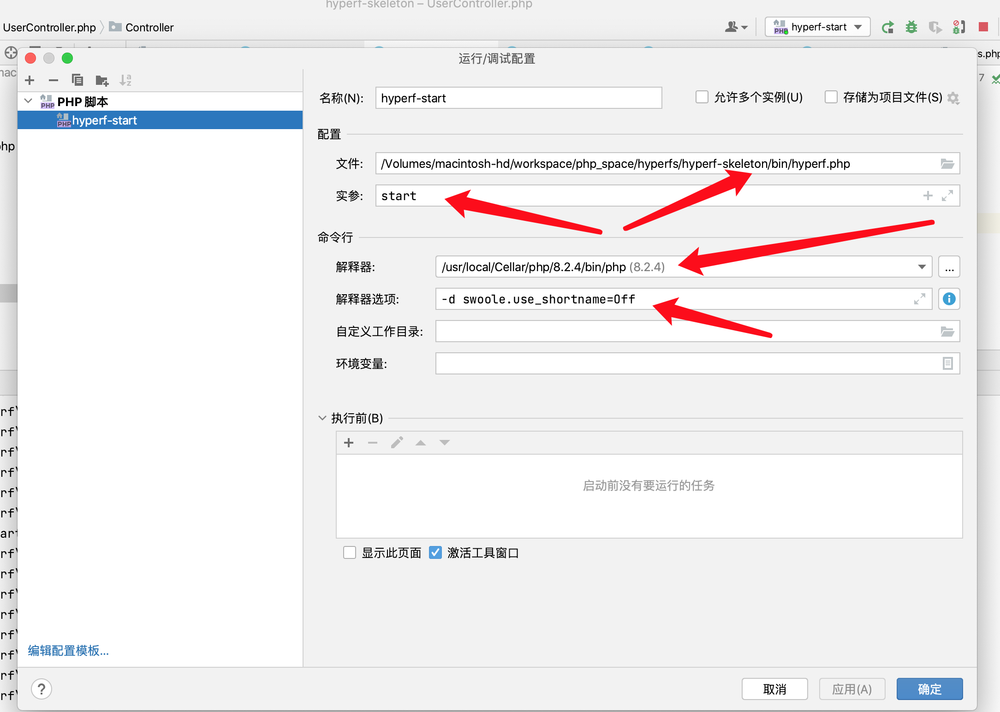

# Introduction

This is a skeleton application using the Hyperf framework. This application is meant to be used as a starting place for those looking to get their feet wet with Hyperf Framework.

# Requirements

Hyperf has some requirements for the system environment, it can only run under Linux and Mac environment, but due to the development of Docker virtualization technology, Docker for Windows can also be used as the running environment under Windows.

The various versions of Dockerfile have been prepared for you in the [hyperf/hyperf-docker](https://github.com/hyperf/hyperf-docker) project, or directly based on the already built [hyperf/hyperf](https://hub.docker.com/r/hyperf/hyperf) Image to run.

When you don't want to use Docker as the basis for your running environment, you need to make sure that your operating environment meets the following requirements:  

 - PHP >= 8.0
 - Any of the following network engines
   - Swoole PHP extension >= 4.5，with `swoole.use_shortname` set to `Off` in your `php.ini`
   - Swow PHP extension (Beta)
 - JSON PHP extension
 - Pcntl PHP extension
 - OpenSSL PHP extension （If you need to use the HTTPS）
 - PDO PHP extension （If you need to use the MySQL Client）
 - Redis PHP extension （If you need to use the Redis Client）
 - Protobuf PHP extension （If you need to use the gRPC Server or Client）

# Installation using Composer

The easiest way to create a new Hyperf project is to use [Composer](https://getcomposer.org/). If you don't have it already installed, then please install as per [the documentation](https://getcomposer.org/download/).

To create your new Hyperf project:

```bash
$ composer create-project hyperf/hyperf-skeleton path/to/install
```

Once installed, you can run the server immediately using the command below.

```bash
$ cd path/to/install
$ php bin/hyperf.php start
```

This will start the cli-server on port `9501`, and bind it to all network interfaces. You can then visit the site at `http://localhost:9501/`

which will bring up Hyperf default home page.


## 运行
参考 [常见问题](https://hyperf.wiki/3.0/#/zh-cn/quick-start/questions)

打开php.ini，在 extension = swoole.so 下面添加 swoole.use_shortname='Off'
或者临时用法
~~~bash
php -d swoole.use_shortname=Off bin/hyperf.php start
~~~

内存问题
> php -d memory_limit=-1 bin/hyperf.php start


重启端口被占用：

先查看被占用的端口是哪个程序
netstat -anp tcp | grep 9501 
或者
lsof -i:9501

一堆进程 不知道那个是master进程 只能全部找到一起杀了才行
❯ lsof -i:9501 | cut -c 4-14

不知道第一行咋跳过 😄
只能自己拷贝出进程id 然后
> echo " 27067 27068 27069 27070 27071 27072 27073 27074 " |xargs kill -9
> 

感觉有点笨


phpstorm 配置：



## 中间件
生成中间件
> php ./bin/hyperf.php gen:middleware Auth/FooMiddleware